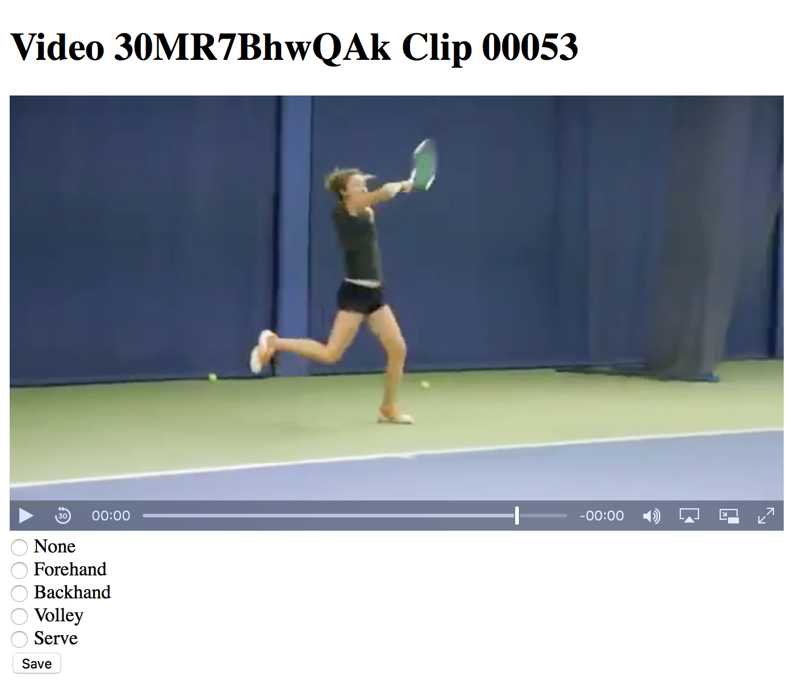

# labelmaker

## Introduction

Labelmaker is a go program for labeling clips for the tennis shot classifier.  It runs a local http server that presents a web form and inline video player.  The user selects which type of shot the clip is and hits save.  That writes the label to an sqlite database and redirects to the next clip.  


## Usage

The program requires go and glide to be installed.
- [Install Go](https://golang.org/dl/)
- [Install Glide](https://glide.sh)

To start labelmaker run the following command:
```bash
make run
```

To start labeling a video find one in ../data/videos folder and go to the following url:
```
http://localhost:9090/view/:video_id/00000
```

Labels will be saved to labels.db as they are created.  To export them to csv run the following command:
```
make csv
```